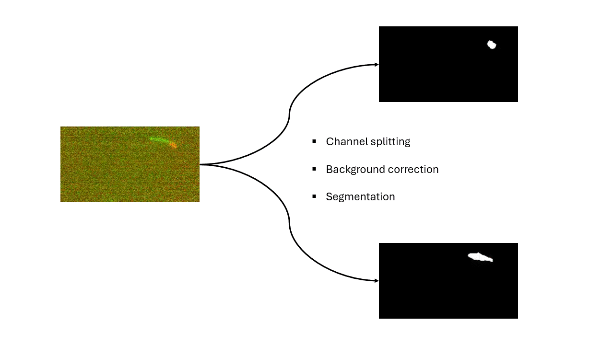
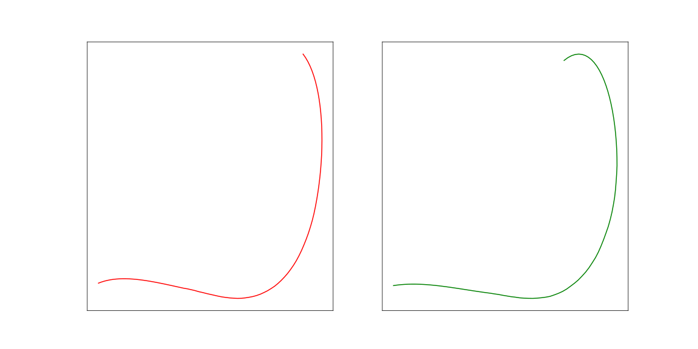
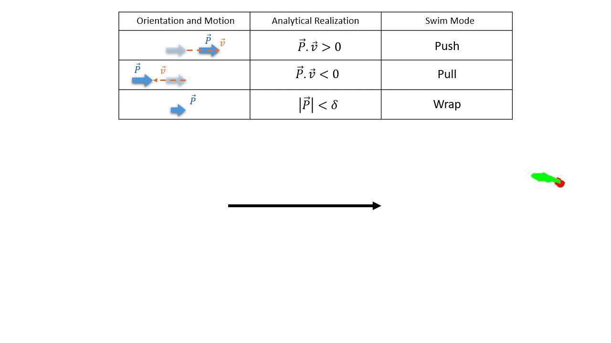

# TrackScoPy
### Split, Track and Classify

 

  

TrackScoPy is a Python-based toolbox for analyzing multi-channel fluorescence microscopy time-lapse images. It works in three steps.

## A) Splitting and processing of color channels

The first step is to separate individual color channels from multi-channel videos, apply pre-processing (like background correction, segmentation) and save the processed stacks for tracking. The processing steps are partially based on \[1\]:

\[1\]M. Hintsche, V. Waljor, R. Großmann, M.J. K¨uhn, K.M. Thormann, F. Peruani, and C. Beta, A polar bundle of flagella can drive bacterial swimming by pushing, pulling, or coiling around the cell body, Sci Rep 7, 16771 (2017) [DOI](https://www.nature.com/articles/s41598-017-16428-9)  

 

  

---

## B) Multi-particle tracking

Then, it uses robust multi-particle Lagrangian tracking to the corresponding segmented stacks individually. The tracking algorithm is based on:

\[2\] J. Crocker, D. Grier, Methods of Digital Video Microscopy for Colloidal Studies, Journal of Colloid and Interface Science, 179, 1 (1996)[DOI](https://doi.org/10.1006/jcis.1996.0217)  

 

  

---

## C) Classification based on trajectory characteristics

After tracking, the toolbox classifies trajectories based on speed, directionality, and channel-specific features. Although this step is very general for different fluorescence experiments corresponding to various biological systems where the classification criteria will change accordingly, we provide a specific example of the motility experiment of a soil bacterium _Pseudomonas putida_. 

 

The speciality of the bacteria is that it can swim in three different modes- **push** (where the bacterium rotates its flagellar bundle in the counter-clockwise direction to move forward along its axis, pointing from the flagellar bundle to cell body), **pull** (where the bacterium rotates its flagellar bundle in the clockwise direction to move backward with respect to its axial direction) and **wrap** (where the bacterium wraps its flagellar bundle around its cell body, in a screw-thread fashion to move) \[2\]. The cell body and the flagella of the bacteria are stained in red and green channels respectively \[3\]. Then, after the steps A and B, as illustrated above, based on the positional alignment of the trajectories of the detected particles and their centers of masses, we can classify each bacterium by their swim-modes. See the main text in the associated paper for further details of the classification criteria for swim-mode detection.

\[3\] V. Pfeifer, V. Muraveva, and C. Beta, Flagella and cell body staining of bacteria with fluorescent dyes, in Cell Motility and Chemotaxis: Methods and Protocols, edited by C. Beta and C. Martinez-Torres (Springer US, New York, NY, 2024) pp. 79–85.[DOI](https://link.springer.com/protocol/10.1007/978-1-0716-4023-4_8)  

 

  

## Instructions for usage

For using this toolbox, follow the instructions here:

[Installation guide](installation.md)

## Cite this project

This framework can be cited by the following Zenodo DOI:
[Zenodo link](https://doi.org/10.xxxxx/zenodo.xxxxx)

The manuscript associated with the specific classification criteria used above as example, can be found here:
[Associated manuscript link](https://arxiv.org/abs/xxxx.xxxx)

